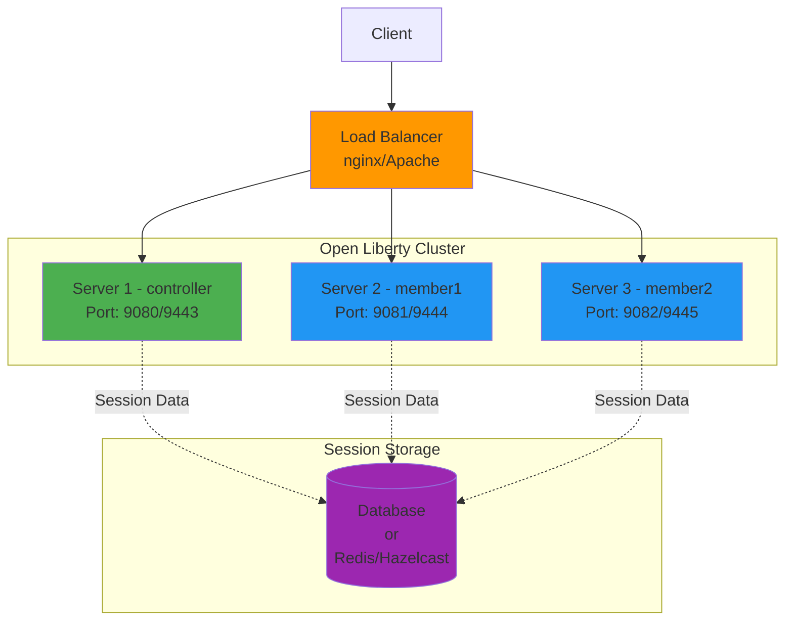

# Open Liberty Cluster Setup Guide

## 📋 Overview

This guide explains how to set up multiple Open Liberty server instances to work together as a cluster. Since we're using Open Liberty (not WebSphere Liberty), we'll use session replication and load balancing techniques instead of the WebSphere collective controller.

---

## 🏗️ Cluster Architecture



---

## 🎯 Clustering Options for Open Liberty

### Option 1: Session Replication with Database
**Best for:** Production environments with persistent session storage

### Option 2: Session Replication with Hazelcast
**Best for:** High-performance, in-memory session sharing

### Option 3: Simple Load Balancing (No Session Sharing)
**Best for:** Stateless applications

---

## 📝 Method 1: Multiple Server Instances (Simple Clustering)

### Step 1: Create Additional Server Configurations

Create a new module for the second server:

```bash
# From project root
mkdir -p liberty-cluster-member1
cd liberty-cluster-member1
```

Create `pom.xml` for member1:

```xml
<?xml version="1.0" encoding="UTF-8"?>
<project xmlns="http://maven.apache.org/POM/4.0.0"
         xmlns:xsi="http://www.w3.org/2001/XMLSchema-instance"
         xsi:schemaLocation="http://maven.apache.org/POM/4.0.0 
         http://maven.apache.org/xsd/maven-4.0.0.xsd">
    <modelVersion>4.0.0</modelVersion>

    <parent>
        <groupId>com.example</groupId>
        <artifactId>liberty-cluster-app-parent</artifactId>
        <version>1.0-SNAPSHOT</version>
    </parent>

    <artifactId>liberty-cluster-member1</artifactId>
    <packaging>pom</packaging>

    <dependencies>
        <dependency>
            <groupId>com.example</groupId>
            <artifactId>liberty-cluster-app-ear</artifactId>
            <version>1.0-SNAPSHOT</version>
            <type>ear</type>
        </dependency>
    </dependencies>

    <build>
        <plugins>
            <plugin>
                <groupId>io.openliberty.tools</groupId>
                <artifactId>liberty-maven-plugin</artifactId>
                <version>${liberty.maven.plugin.version}</version>
                <configuration>
                    <serverName>member1</serverName>
                    <runtimeArtifact>
                        <groupId>io.openliberty</groupId>
                        <artifactId>openliberty-runtime</artifactId>
                        <version>25.0.0.11</version>
                        <type>zip</type>
                    </runtimeArtifact>
                    <configDirectory>${project.basedir}/src/main/liberty/config</configDirectory>
                </configuration>
            </plugin>
        </plugins>
    </build>
</project>
```

### Step 2: Create Server Configuration for Member1

Create directory structure:
```bash
mkdir -p src/main/liberty/config
```

Create `src/main/liberty/config/server.xml`:

```xml
<server description="Open Liberty Cluster Member 1">

    <featureManager>
        <feature>javaee-8.0</feature>
        <feature>sessionDatabase-1.0</feature>
        <!-- For session replication -->
    </featureManager>

    <!-- Different ports from controller -->
    <httpEndpoint id="defaultHttpEndpoint"
                  host="*"
                  httpPort="9081"
                  httpsPort="9444" />

    <quickStartSecurity userName="admin" userPassword="adminpwd" />

    <applicationManager autoExpand="true"/>

    <!-- Reference to the EAR application -->
    <application type="ear"
                 id="liberty-cluster-app"
                 location="${shared.app.dir}/liberty-cluster-app-ear-1.0-SNAPSHOT.ear"
                 name="liberty-cluster-app"/>

    <keyStore id="defaultKeyStore" password="Liberty" />

    <!-- Session configuration for clustering -->
    <httpSession cloneId="member1" />

</server>
```

### Step 3: Update Parent POM

Add the new module to parent `pom.xml`:

```xml
<modules>
    <module>liberty-cluster-app-war</module>
    <module>liberty-cluster-app-ear</module>
    <module>liberty-cluster-member1</module>
</modules>
```

### Step 4: Start Multiple Servers

```bash
# Terminal 1 - Start controller
cd liberty-cluster-app-ear
mvn liberty:dev

# Terminal 2 - Start member1
cd liberty-cluster-member1
mvn liberty:dev
```

---

## 📝 Method 2: Session Replication with Database

### Step 1: Add Database Session Feature

Update `server.xml` for all servers:

```xml
<featureManager>
    <feature>javaee-8.0</feature>
    <feature>sessionDatabase-1.0</feature>
</featureManager>

<!-- Database configuration -->
<dataSource id="SessionDS" jndiName="jdbc/sessions">
    <jdbcDriver libraryRef="PostgreSQLLib"/>
    <properties.postgresql 
        serverName="localhost" 
        portNumber="5432"
        databaseName="sessions"
        user="dbuser"
        password="dbpass"/>
</dataSource>

<library id="PostgreSQLLib">
    <fileset dir="${server.config.dir}/lib" includes="postgresql-*.jar"/>
</library>

<!-- Session persistence configuration -->
<httpSessionDatabase 
    id="SessionDB" 
    dataSourceRef="SessionDS"
    writeFrequency="END_OF_SERVLET_SERVICE"
    writeInterval="120s"
    writeContents="ONLY_UPDATED_ATTRIBUTES"/>

<httpSession 
    cloneId="${server.name}"
    storageRef="SessionDB"/>
```

### Step 2: Set Up Database

```sql
-- PostgreSQL example
CREATE DATABASE sessions;

CREATE TABLE sessions (
    id VARCHAR(128) NOT NULL PRIMARY KEY,
    propid VARCHAR(128) NOT NULL,
    appname VARCHAR(128) NOT NULL,
    listenercnt SMALLINT,
    lastaccess BIGINT,
    creationtime BIGINT,
    maxinactivetime INTEGER,
    username VARCHAR(256),
    small BYTEA,
    medium BYTEA,
    large BYTEA
);

CREATE INDEX idx_sessions_propid ON sessions(propid);
```

---

## 📝 Method 3: Session Replication with Hazelcast

### Step 1: Add Hazelcast Dependencies

Add to WAR `pom.xml`:

```xml
<dependency>
    <groupId>com.hazelcast</groupId>
    <artifactId>hazelcast</artifactId>
    <version>5.3.6</version>
</dependency>
```

### Step 2: Configure Hazelcast

Create `hazelcast.xml` in `src/main/resources`:

```xml
<hazelcast xmlns="http://www.hazelcast.com/schema/config">
    <cluster-name>liberty-cluster</cluster-name>
    
    <network>
        <port auto-increment="true">5701</port>
        <join>
            <multicast enabled="true">
                <multicast-group>224.2.2.3</multicast-group>
                <multicast-port>54327</multicast-port>
            </multicast>
        </join>
    </network>
    
    <map name="sessions">
        <backup-count>1</backup-count>
        <time-to-live-seconds>1800</time-to-live-seconds>
    </map>
</hazelcast>
```

### Step 3: Update server.xml

```xml
<featureManager>
    <feature>javaee-8.0</feature>
    <feature>sessionCache-1.0</feature>
</featureManager>

<httpSessionCache 
    libraryRef="HazelcastLib"
    uri="hazelcast:sessions"/>

<library id="HazelcastLib">
    <fileset dir="${server.config.dir}/lib" includes="hazelcast-*.jar"/>
</library>
```

---

## 🔧 Load Balancer Configuration

### Option 1: Nginx Configuration

Create `nginx.conf`:

```nginx
upstream liberty_cluster {
    least_conn;
    server localhost:9080 weight=1 max_fails=3 fail_timeout=30s;
    server localhost:9081 weight=1 max_fails=3 fail_timeout=30s;
    server localhost:9082 weight=1 max_fails=3 fail_timeout=30s;
}

server {
    listen 80;
    server_name localhost;

    location / {
        proxy_pass http://liberty_cluster;
        proxy_set_header Host $host;
        proxy_set_header X-Real-IP $remote_addr;
        proxy_set_header X-Forwarded-For $proxy_add_x_forwarded_for;
        proxy_set_header X-Forwarded-Proto $scheme;
        
        # Session stickiness
        proxy_cookie_path / "/; HTTPOnly; Secure";
    }

    location /liberty-cluster-app/ {
        proxy_pass http://liberty_cluster/liberty-cluster-app/;
        proxy_set_header Host $host;
        proxy_set_header X-Real-IP $remote_addr;
    }
}
```

Start nginx:
```bash
nginx -c /path/to/nginx.conf
```

### Option 2: Apache HTTP Server Configuration

Create `httpd.conf` section:

```apache
<Proxy balancer://liberty_cluster>
    BalancerMember http://localhost:9080 route=controller
    BalancerMember http://localhost:9081 route=member1
    BalancerMember http://localhost:9082 route=member2
    ProxySet lbmethod=byrequests
    ProxySet stickysession=JSESSIONID
</Proxy>

<VirtualHost *:80>
    ServerName localhost
    
    ProxyPreserveHost On
    ProxyPass / balancer://liberty_cluster/
    ProxyPassReverse / balancer://liberty_cluster/
    
    <Location /balancer-manager>
        SetHandler balancer-manager
        Require host localhost
    </Location>
</VirtualHost>
```

---

## 🧪 Testing the Cluster

### Test 1: Verify All Servers Are Running

```bash
# Check controller
curl http://localhost:9080/liberty-cluster-app/api/cluster

# Check member1
curl http://localhost:9081/liberty-cluster-app/api/cluster

# Check member2
curl http://localhost:9082/liberty-cluster-app/api/cluster
```

### Test 2: Test Load Balancing

```bash
# Through load balancer
for i in {1..10}; do
    curl http://localhost/liberty-cluster-app/api/cluster
    echo ""
done
```

### Test 3: Test Session Replication

Create a test servlet to verify session replication:

```java
@WebServlet("/session-test")
public class SessionTestServlet extends HttpServlet {
    protected void doGet(HttpServletRequest request, 
                        HttpServletResponse response) 
            throws ServletException, IOException {
        
        HttpSession session = request.getSession();
        Integer counter = (Integer) session.getAttribute("counter");
        
        if (counter == null) {
            counter = 0;
        }
        counter++;
        
        session.setAttribute("counter", counter);
        
        response.setContentType("application/json");
        response.getWriter().write(String.format(
            "{\"sessionId\":\"%s\",\"counter\":%d,\"server\":\"%s\"}",
            session.getId(),
            counter,
            System.getProperty("wlp.server.name")
        ));
    }
}
```

Test session stickiness:
```bash
# Get session cookie
curl -c cookies.txt http://localhost/liberty-cluster-app/session-test

# Verify session persists across requests
curl -b cookies.txt http://localhost/liberty-cluster-app/session-test
curl -b cookies.txt http://localhost/liberty-cluster-app/session-test
```

---

## 📊 Monitoring the Cluster

### View Server Status

```bash
# Controller
curl http://localhost:9080/liberty-cluster-app/api/cluster

# Member 1
curl http://localhost:9081/liberty-cluster-app/api/cluster

# Member 2
curl http://localhost:9082/liberty-cluster-app/api/cluster
```

### Check Admin Center

Access each server's Admin Center:
- Controller: https://localhost:9443/adminCenter/
- Member 1: https://localhost:9444/adminCenter/
- Member 2: https://localhost:9445/adminCenter/

---

## 🔒 Security Considerations

### 1. Secure Inter-Server Communication

```xml
<ssl id="defaultSSLConfig"
     keyStoreRef="defaultKeyStore"
     trustStoreRef="defaultTrustStore"/>

<keyStore id="defaultKeyStore"
          location="key.p12"
          password="{xor}encrypted_password"/>

<keyStore id="defaultTrustStore"
          location="trust.p12"
          password="{xor}encrypted_password"/>
```

### 2. Enable HTTPS Only

```xml
<httpEndpoint id="defaultHttpEndpoint"
              host="*"
              httpsPort="9443">
    <httpOptions removeServerHeader="true"/>
    <accessLogging filepath="${server.output.dir}/logs/http_access.log"/>
</httpEndpoint>
```

### 3. Configure Firewall Rules

```bash
# Allow only necessary ports
sudo ufw allow 9080/tcp  # HTTP
sudo ufw allow 9443/tcp  # HTTPS
sudo ufw allow 5701/tcp  # Hazelcast (if used)
```

---

## 🚀 Production Deployment

### Deployment Checklist

- [ ] Configure session replication (database or Hazelcast)
- [ ] Set up load balancer (nginx or Apache)
- [ ] Configure SSL certificates
- [ ] Enable monitoring and logging
- [ ] Set up health checks
- [ ] Configure auto-scaling (if using cloud)
- [ ] Test failover scenarios
- [ ] Document recovery procedures
- [ ] Set up backup strategy
- [ ] Configure alerts and notifications

### Docker Deployment (Optional)

Create `Dockerfile`:

```dockerfile
FROM icr.io/appcafe/open-liberty:full-java17-openj9-ubi

COPY --chown=1001:0 liberty-cluster-app-ear/target/*.ear /config/apps/
COPY --chown=1001:0 liberty-cluster-app-ear/src/main/liberty/config/server.xml /config/

RUN configure.sh
```

Create `docker-compose.yml`:

```yaml
version: '3.8'

services:
  controller:
    build: .
    ports:
      - "9080:9080"
      - "9443:9443"
    environment:
      - SERVER_NAME=controller
    networks:
      - liberty-cluster

  member1:
    build: .
    ports:
      - "9081:9080"
      - "9444:9443"
    environment:
      - SERVER_NAME=member1
    networks:
      - liberty-cluster

  member2:
    build: .
    ports:
      - "9082:9080"
      - "9445:9443"
    environment:
      - SERVER_NAME=member2
    networks:
      - liberty-cluster

  nginx:
    image: nginx:alpine
    ports:
      - "80:80"
    volumes:
      - ./nginx.conf:/etc/nginx/nginx.conf:ro
    depends_on:
      - controller
      - member1
      - member2
    networks:
      - liberty-cluster

networks:
  liberty-cluster:
    driver: bridge
```

Start the cluster:
```bash
docker-compose up -d
```

---

## 📝 Quick Reference Commands

### Start Cluster
```bash
# Terminal 1
cd liberty-cluster-app-ear && mvn liberty:dev

# Terminal 2
cd liberty-cluster-member1 && mvn liberty:dev

# Terminal 3
cd liberty-cluster-member2 && mvn liberty:dev
```

### Stop Cluster
```bash
# Press Ctrl+C in each terminal
# Or
mvn liberty:stop
```

### Check Status
```bash
curl http://localhost:9080/liberty-cluster-app/api/cluster
curl http://localhost:9081/liberty-cluster-app/api/cluster
curl http://localhost:9082/liberty-cluster-app/api/cluster
```

### View Logs
```bash
tail -f liberty-cluster-app-ear/target/liberty/wlp/usr/servers/controller/logs/messages.log
tail -f liberty-cluster-member1/target/liberty/wlp/usr/servers/member1/logs/messages.log
```

---

## 🔍 Troubleshooting

### Issue: Port Already in Use
```bash
# Find process
lsof -i :9080

# Kill process
kill -9 <PID>
```

### Issue: Session Not Replicating
1. Check database connection
2. Verify sessionDatabase feature is enabled
3. Check session configuration in server.xml
4. Review logs for errors

### Issue: Load Balancer Not Distributing
1. Verify all servers are running
2. Check load balancer configuration
3. Test each server individually
4. Review load balancer logs

---

## 📚 Additional Resources

- [Open Liberty Session Management](https://openliberty.io/docs/latest/reference/feature/sessionDatabase-1.0.html)
- [Hazelcast Documentation](https://docs.hazelcast.com/)
- [Nginx Load Balancing](https://nginx.org/en/docs/http/load_balancing.html)
- [Apache mod_proxy_balancer](https://httpd.apache.org/docs/current/mod/mod_proxy_balancer.html)

---

**Last Updated:** 2025-11-12  
**Version:** 1.0  
**For:** Open Liberty 25.0.0.11