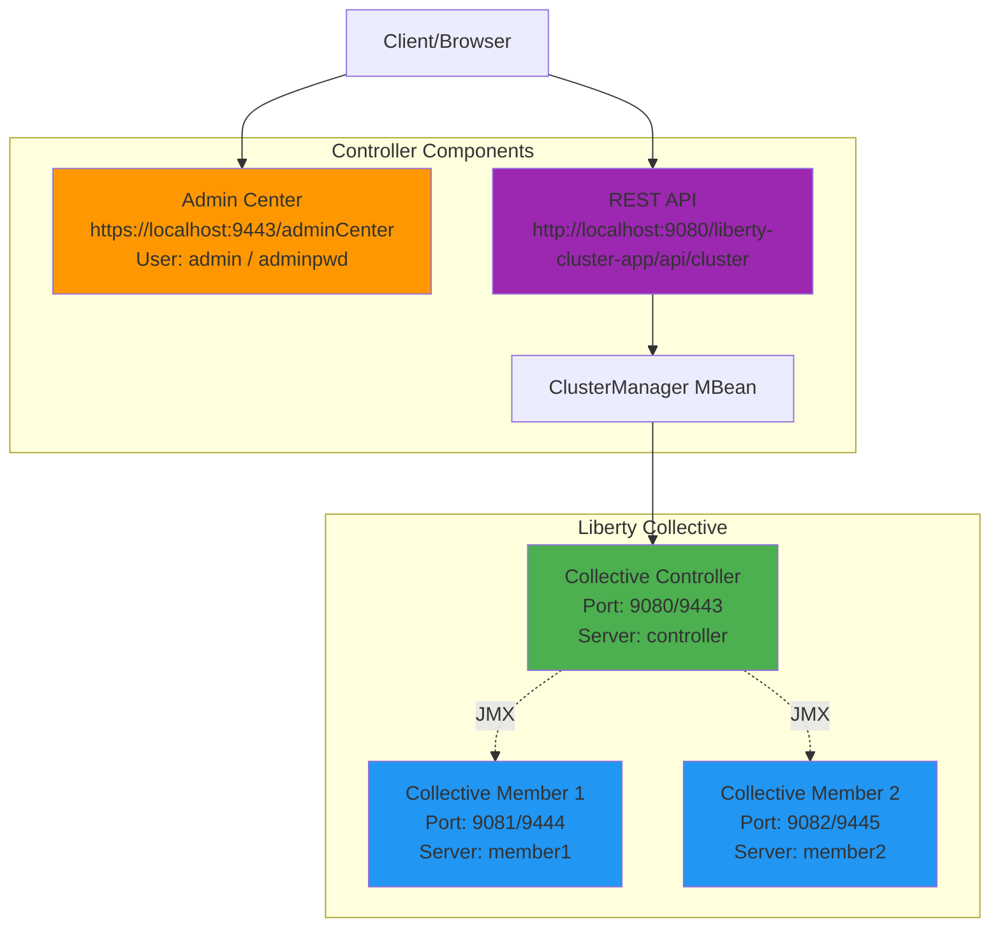

# Liberty Cluster Deployment

A production-ready IBM WebSphere Liberty cluster application demonstrating collective controller setup, cluster management, and RESTful services for querying cluster member information.

## 📋 Table of Contents

- [Overview](#overview)
- [Architecture](#architecture)
- [Project Structure](#project-structure)
- [Requirements](#requirements)
- [Quick Start](#quick-start)
- [Building the Project](#building-the-project)
- [Running the Application](#running-the-application)
- [Accessing the Application](#accessing-the-application)
- [API Documentation](#api-documentation)
- [Cluster Setup](#cluster-setup)
- [Troubleshooting](#troubleshooting)
- [Security Considerations](#security-considerations)
- [Production Deployment](#production-deployment)

## 🎯 Overview

This project demonstrates how to create a clustered IBM WebSphere Liberty environment with:

- **Java EE 8** application server
- **Collective Controller** for cluster management
- **Admin Center** for web-based administration
- **RESTful API** for querying cluster information
- **Maven-based** build and deployment

## 🏗️ Architecture



### Key Components

- **Collective Controller**: Central management server that coordinates cluster members
- **Cluster Members**: Application servers that join the collective and run applications
- **Admin Center**: Web-based UI for managing the collective and deployed applications
- **REST API**: JAX-RS service that queries cluster information via JMX MBeans

## 📁 Project Structure

```
liberty-cluster-app-parent/
├── pom.xml                                    # Parent POM with common configuration
├── README.md                                  # This file
├── SETUP.md                                   # Detailed setup guide
├── TODO.md                                    # Project tasks and status
├── liberty-cluster-app-war/                   # WAR module
│   ├── pom.xml
│   └── src/main/java/com/example/liberty/cluster/
│       ├── ClusterInfoResource.java           # REST endpoint for cluster info
│       └── JAXRSConfiguration.java            # JAX-RS application configuration
└── liberty-cluster-app-ear/                   # EAR module
    ├── pom.xml
    └── src/main/
        ├── application/META-INF/
        │   └── application.xml                # EAR deployment descriptor
        └── liberty/config/
            ├── server.xml                     # Liberty server configuration
            └── server.env                     # Environment variables
```

## ✅ Requirements

- **Java Development Kit (JDK)**: 17 or later
- **Apache Maven**: 3.6 or later
- **IBM WebSphere Liberty**: Automatically downloaded by Maven (22.0.0.1)
- **Operating System**: Windows, macOS, or Linux

### Verify Prerequisites

```bash
# Check Java version
java -version

# Check Maven version
mvn -version
```

## 🚀 Quick Start

### 1. Clone the Repository

```bash
git clone <repository-url>
cd LibertyClusterDeployment
```

### 2. Build the Project

```bash
mvn clean install
```

This will:
- Compile the Java source code
- Package the WAR file
- Package the EAR file
- Download IBM WebSphere Liberty runtime (first time only)

### 3. Run the Application

```bash
cd liberty-cluster-app-ear
mvn liberty:dev
```

The `liberty:dev` goal provides:
- Automatic server start
- Hot reload on code changes
- Automatic test execution
- Interactive console

### 4. Access the Application

Once the server starts, you can access:

- **REST API**: http://localhost:9080/liberty-cluster-app/api/cluster
- **Admin Center**: https://localhost:9443/adminCenter/
  - Username: `admin`
  - Password: `adminpwd`

## 🔨 Building the Project

### Full Build

```bash
mvn clean install
```

### Build Without Tests

```bash
mvn clean install -DskipTests
```

### Build Specific Module

```bash
# Build only WAR
cd liberty-cluster-app-war
mvn clean package

# Build only EAR
cd liberty-cluster-app-ear
mvn clean package
```

## ▶️ Running the Application

### Development Mode (Recommended)

Development mode provides hot reload and automatic restart:

```bash
cd liberty-cluster-app-ear
mvn liberty:dev
```

**Features:**
- Press `Enter` to run tests
- Press `r` to restart the server
- Press `Ctrl+C` to stop

### Production Mode

For production-like testing:

```bash
cd liberty-cluster-app-ear
mvn liberty:run
```

To stop the server:
```bash
mvn liberty:stop
```

### Debug Mode

To run with debugging enabled:

```bash
cd liberty-cluster-app-ear
mvn liberty:debug
```

Connect your debugger to port `7777`.

## 🌐 Accessing the Application

### REST API Endpoints

#### Get Cluster Information

```bash
# Using curl
curl http://localhost:9080/liberty-cluster-app/api/cluster

# Using wget
wget -qO- http://localhost:9080/liberty-cluster-app/api/cluster

# Using PowerShell (Windows)
Invoke-WebRequest -Uri http://localhost:9080/liberty-cluster-app/api/cluster
```

**Expected Response (Controller):**
```json
[]
```
*Note: Empty array indicates no clusters are defined yet. See [Cluster Setup](#cluster-setup) to create clusters.*

**Expected Response (Non-Controller):**
```json
{
  "message": "This server is not a collective controller."
}
```

### Admin Center

1. Open browser: https://localhost:9443/adminCenter/
2. Accept the self-signed certificate warning
3. Login with:
   - **Username**: `admin`
   - **Password**: `adminpwd`

**Admin Center Features:**
- View server status and metrics
- Manage applications
- Configure server settings
- Monitor collective members
- View logs and traces

## 📚 API Documentation

### Cluster Info Resource

**Endpoint:** `/api/cluster`

**Method:** `GET`

**Description:** Returns information about clusters managed by the collective controller.

**Response Codes:**
- `200 OK`: Successfully retrieved cluster information
- `500 Internal Server Error`: Error accessing cluster information

**Response Format:** JSON

**Example Responses:**

1. **When running on collective controller with no clusters:**
```json
[]
```

2. **When running on collective controller with clusters:**
```json
["cluster1", "cluster2"]
```

3. **When running on non-controller server:**
```json
{
  "message": "This server is not a collective controller."
}
```

4. **Error response:**
```json
{
  "error": "Error message details"
}
```

## 🔧 Cluster Setup

This project sets up a single Liberty server as a collective controller. To create a full cluster:

### Step 1: Create Additional Server Configurations

Create a new server configuration for a cluster member:

```bash
# Navigate to Liberty installation
cd liberty-cluster-app-ear/target/liberty/wlp/bin

# Create a new server
./server create member1
```

### Step 2: Configure the Member Server

Edit `usr/servers/member1/server.xml`:

```xml
<server description="Liberty Collective Member">
    <featureManager>
        <feature>javaee-8.0</feature>
        <feature>collectiveMember-1.0</feature>
    </featureManager>

    <httpEndpoint id="defaultHttpEndpoint"
                  host="*"
                  httpPort="9081"
                  httpsPort="9444" />

    <collectiveMember>
        <controllerHost>localhost</controllerHost>
        <controllerHttpsPort>9443</controllerHttpsPort>
    </collectiveMember>
</server>
```

### Step 3: Join Member to Collective

```bash
# From Liberty bin directory
./collective join member1 \
  --host=localhost \
  --port=9443 \
  --user=admin \
  --password=adminpwd
```

### Step 4: Start the Member Server

```bash
./server start member1
```

### Step 5: Verify Cluster Setup

Check the Admin Center or use the REST API to verify the member has joined.

## 🔍 Troubleshooting

### Common Issues and Solutions

#### 1. License Acceptance Error

**Error:**
```
License acceptance is required to download WebSphere Liberty
```

**Solution:**
The POM is already configured with `<acceptLicense>true</acceptLicense>`. If you still see this error, ensure you're using the latest version of the project.

#### 2. Port Already in Use

**Error:**
```
Port 9080 is already in use
```

**Solution:**
```bash
# Find process using the port (Linux/Mac)
lsof -i :9080

# Find process using the port (Windows)
netstat -ano | findstr :9080

# Kill the process or change the port in server.xml
```

#### 3. Admin Center Not Accessible

**Error:**
Cannot access https://localhost:9443/adminCenter/

**Solution:**
1. Verify the server is running: `mvn liberty:status`
2. Check if quickStartSecurity is configured in `server.xml`
3. Accept the self-signed certificate in your browser
4. Verify credentials: `admin` / `adminpwd`

#### 4. Application Not Deployed

**Error:**
Application not found at http://localhost:9080/liberty-cluster-app/api/cluster

**Solution:**
1. Check server logs: `liberty-cluster-app-ear/target/liberty/wlp/usr/servers/controller/logs/messages.log`
2. Verify EAR file exists: `liberty-cluster-app-ear/target/liberty-cluster-app-ear-1.0-SNAPSHOT.ear`
3. Rebuild: `mvn clean install`
4. Restart server: `mvn liberty:stop` then `mvn liberty:dev`

#### 5. Build Failures

**Error:**
Maven build fails with compilation errors

**Solution:**
```bash
# Clean Maven cache
mvn clean

# Update dependencies
mvn dependency:purge-local-repository

# Rebuild
mvn clean install -U
```

#### 6. JMX Connection Issues

**Error:**
Cannot access ClusterManager MBean

**Solution:**
1. Verify `collectiveController-1.0` feature is enabled
2. Check that the server is running as a controller
3. Ensure JMX is properly configured in `server.xml`

### Debug Logging

Enable debug logging in `server.xml`:

```xml
<logging traceSpecification="*=info:com.example.liberty.cluster.*=all" />
```

View logs:
```bash
tail -f liberty-cluster-app-ear/target/liberty/wlp/usr/servers/controller/logs/messages.log
```

## 🔒 Security Considerations

### Development vs. Production

**Current Configuration (Development):**
- Uses `quickStartSecurity` with hardcoded credentials
- Self-signed SSL certificates
- No encryption for JMX communication

**Production Recommendations:**

1. **Use Proper User Registry**
```xml
<basicRegistry id="basic" realm="BasicRealm">
    <user name="admin" password="{xor}Lz4sLCgwLTs=" />
</basicRegistry>
```

2. **Configure SSL with Valid Certificates**
```xml
<keyStore id="defaultKeyStore" 
          location="key.jks" 
          password="{xor}encrypted_password" />
```

3. **Enable HTTPS Only**
```xml
<httpEndpoint id="defaultHttpEndpoint"
              host="*"
              httpsPort="9443">
    <httpOptions removeServerHeader="true" />
</httpEndpoint>
```

4. **Secure JMX Communication**
```xml
<collectiveController>
    <ssl sslRef="defaultSSLConfig" />
</collectiveController>
```

5. **Use Environment Variables for Secrets**
```xml
<quickStartSecurity userName="${env.ADMIN_USER}" 
                    userPassword="${env.ADMIN_PASSWORD}" />
```

### Password Encryption

Encrypt passwords using Liberty's `securityUtility`:

```bash
cd liberty-cluster-app-ear/target/liberty/wlp/bin
./securityUtility encode myPassword
```

## 🚀 Production Deployment

### Deployment Checklist

- [ ] Replace `quickStartSecurity` with proper user registry
- [ ] Configure valid SSL certificates
- [ ] Enable HTTPS only (disable HTTP)
- [ ] Set up proper logging and monitoring
- [ ] Configure resource limits (heap size, thread pools)
- [ ] Enable security auditing
- [ ] Set up backup and disaster recovery
- [ ] Configure load balancing
- [ ] Implement health checks
- [ ] Set up centralized logging

### Environment-Specific Configuration

Use Maven profiles for different environments:

```xml
<profiles>
    <profile>
        <id>dev</id>
        <properties>
            <liberty.env>development</liberty.env>
        </properties>
    </profile>
    <profile>
        <id>prod</id>
        <properties>
            <liberty.env>production</liberty.env>
        </properties>
    </profile>
</profiles>
```

Build for production:
```bash
mvn clean install -Pprod
```

### Performance Tuning

Configure JVM options in `jvm.options`:

```
-Xms512m
-Xmx2048m
-XX:+UseG1GC
-XX:MaxGCPauseMillis=200
```

### Monitoring and Health Checks

Enable monitoring features:

```xml
<featureManager>
    <feature>mpHealth-3.0</feature>
    <feature>mpMetrics-3.0</feature>
</featureManager>
```

Health check endpoint: http://localhost:9080/health
Metrics endpoint: http://localhost:9080/metrics

## 📖 Additional Resources

- [IBM WebSphere Liberty Documentation](https://www.ibm.com/docs/en/was-liberty)
- [Liberty Collective Documentation](https://www.ibm.com/docs/en/was-liberty/base?topic=liberty-collectives)
- [JAX-RS 2.1 Specification](https://jakarta.ee/specifications/restful-ws/2.1/)
- [Maven Liberty Plugin](https://github.com/OpenLiberty/ci.maven)

## 📝 License

This project uses IBM WebSphere Liberty, which requires license acceptance. The license is automatically accepted during the Maven build process via the `<acceptLicense>true</acceptLicense>` configuration.

## 🤝 Contributing

For detailed setup instructions, see [SETUP.md](SETUP.md).

## 📧 Support

For issues and questions:
1. Check the [Troubleshooting](#troubleshooting) section
2. Review server logs in `target/liberty/wlp/usr/servers/controller/logs/`
3. Consult IBM WebSphere Liberty documentation

---

**Version:** 1.0-SNAPSHOT  
**Last Updated:** 2025-11-12  
**Java Version:** 17  
**Liberty Version:** 22.0.0.1
